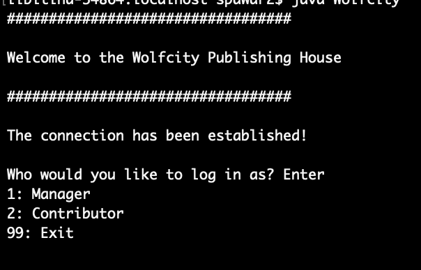
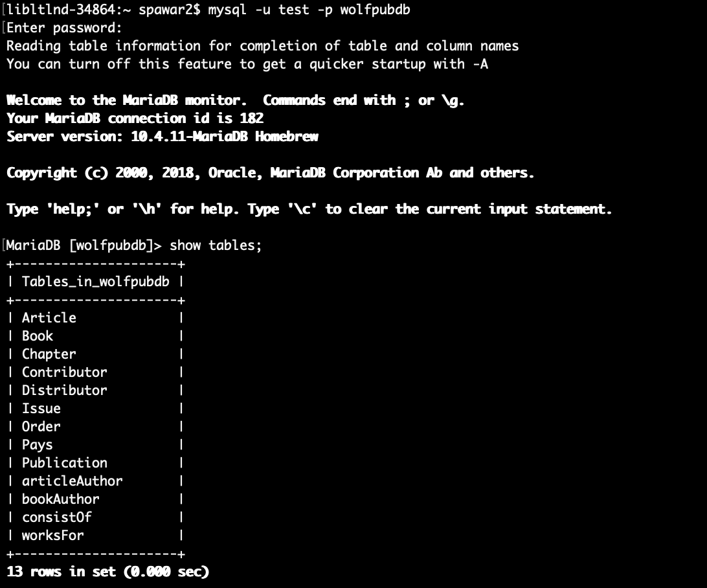
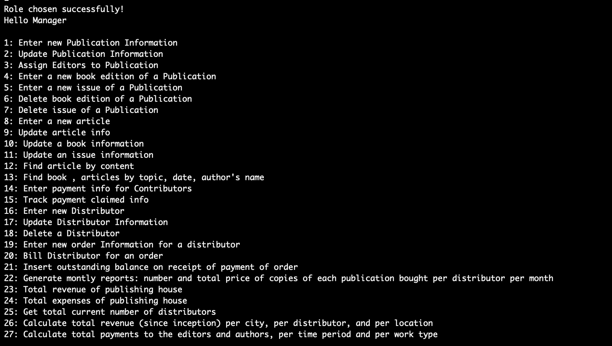

# WolfPubDB

## Index

- [Problem Statment](#Problem-Statment)
- [Solution](#Solution)
- [Contributors](#Contributors)
- [Screenshots](#Screenshots)


### Problem Statment
    You are to build a database system, WolfPubDb, for the WolfCity publishing house. The database system will be used by the management and editors of the publishing house, and should maintain information on at least the following: 

    publication: title, editor(s), type (book, journal, magazine), periodicity for periodic publication (weekly, monthly, etc), typical topics (e.g., general, sports, technology, etc);
    edition (1st, 2nd, etc), ISBN number, and publication date for a book;
    issue of a periodic publication: title, date of issue, articles in the issue;
    for a book or article: author(s), title, date of creation, text of the article;
    distributor: name, type (wholesale distributor, bookstore, library), street address, city, phone number, contact person, balance (how much is owed to the publishing house); 
    order (this is a request for a certain number of copies of a book or of an issue of a periodic publication to be produced by a certain date to meet a distributor's demand): distributor, title of book or issue, number of copies, date, price, shipping cost.


### Tasks and Operations to be performed
    The following are the four major kinds of tasks that need to be performed using your database. Each task potentially consists of a number of operations; an "operation" is something that corresponds to a separate action. For example, Editing and publishing is considered one task, which involves separate operations such as entering basic information on a new publication, updating information, and assigning editors to publications. 

    Each student should write about the same number of application programs, but it is up to each team to decide how to allocate the overall effort. 

    # Editing and publishing
    Enter basic information on a new publication. Update information. Assign editor(s) to publication. Let each editor view the information on the publications he/she is responsible for. Edit table of contents of a publication, by adding/deleting articles (for periodic publications) or chapters/sections (for books).

    # Book 
    Production of a book edition or of an issue of a publication. Enter a new book edition or new issue of a publication. Update, delete a book edition or publication issue. Enter/update an article or chapter: title, author's name, topic, and date. Enter/update text of an article. Find books and articles by topic, date, author's name. Enter payment for author or editor, and keep track of when each payment was claimed by its addressee. 
    Distribution. Enter new distributor; update distributor information; delete a distributor. Input orders from distributors, for a book edition or an issue of a publication per distributor, for a certain date. Bill distributor for an order; change outstanding balance of a distributor on receipt of a payment. 
    
    # Reports 
    Generate montly reports: number and total price of copies of each publication bought per distributor per month; total revenue of the publishing house; total expenses (i.e., shipping costs and salaries). Calculate the total current number of distributors; calculate total revenue (since inception) per city, per distributor, and per location. Calculate total payments to the editors and authors, per time period and per work type (book authorship, article authorship, or editorial work). 

### Solution

Execution Steps

Start
```javac Wolfcity.java ```
```java Wolfcity```

File transfer
    
``` scp GetConnection.java spawar2@remote.eos.ncsu.edu:/afs/unity.ncsu.edu/users/s/spawar2```

MariaDB connectivity

``` ssh spawar2@remote.eos.ncsu.edu```

Enter your Unity-Id password

```add mysql```

```add jdk```

```mysql -u atiwari4 -p -h classdb2.csc.ncsu.edu```
dbmsscammers
Use unity-id as a database

```use atiwari4```

select * from Publication;

TO transfer file betweeb remote and local
```scp  spawar2@remote.eos.ncsu.edu:/afs/unity.ncsu.edu/users/s/spawar2/atiwari4.sql  db.sql```

Import a database
from terminal
```mysql -u test -p wolfpubdb < db.sql```

Move to the DB from terminal
```mysql -u test -p wolfpubdb```


### Screenshots




### Contributors
- Suraj Pawar
- Amit Ghetiya
- Ankit Tiwari
- Rishal Shah

